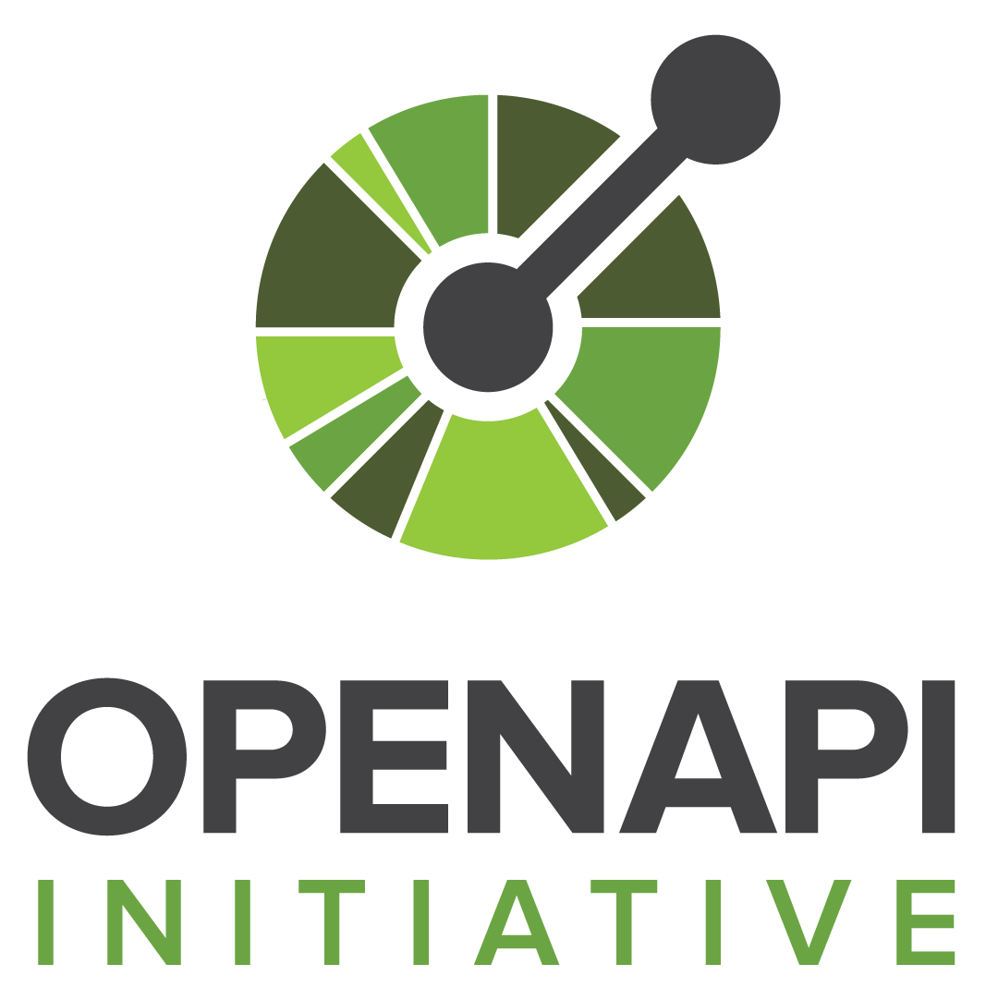
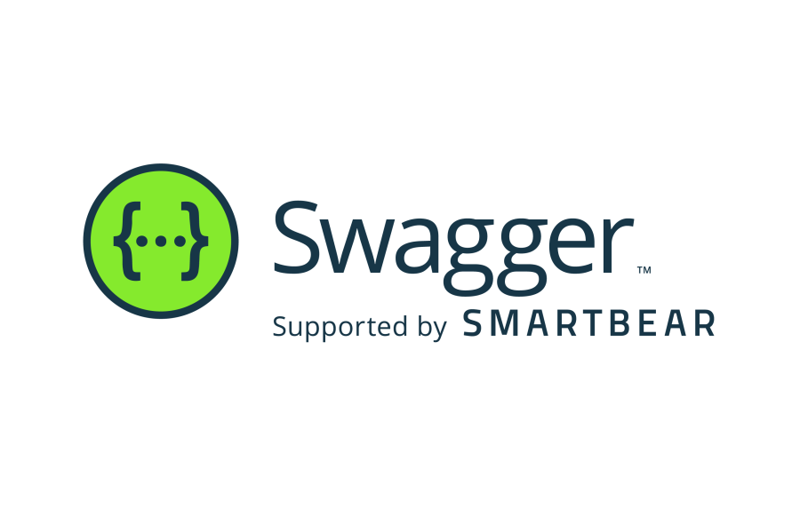

# Documenter/Normer son API

---v---


## Une convention ?

---v---

# OpenAPI Specification



- github repository _https://github.com/OAI/OpenAPI-Specification_

---v---


### C'est quoi ?

---v---

> The OpenAPI Specification is a specification language for HTTP APIs that provides a standardized means to define your API to others. You can quickly discover how an API works, configure infrastructure, generate client code, and create test cases for your APIs. Read more about how you can get control of your APIs now, understand the full API lifecycle and communicate with developer communities inside and outside your organization.

- source _https://www.openapis.org/_

---v---

Cela vous permet de:

- Concevoir vos APIs
- Documenter vos APIs (HTML, PDF, etc.)
- Générer du code client pour vos APIs
- Générer du code serveur pour vos APIs
- Faciliter les tests de vos APIs

note:
adaptation de la doc/code en fonction des changements

---h---


### Comment ça marche ?

---v---

Il suffit de décrire notre API en utilisant le langage de la spécification *OpenAPI*.

---v---

Nous pouvons utiliser du **JSON** 🤮

```json
{
  "openapi": "3.0.0",
  "info": {
    "title": "Sample API",
    "description": "Optional multiline or single-line description in [CommonMark](http://commonmark.org/help/) or HTML.",
    "version": "0.1.9"
  },
  "servers": [
    {
      "url": "http://api.example.com/v1",
      "description": "Optional server description, e.g. Main (production) server"
    },
    {
      "url": "http://staging-api.example.com",
      "description": "Optional server description, e.g. Internal staging server for testing"
    }
  ],
  "paths": {
    "/users": {
      "get": {
        "summary": "Returns a list of users.",
        "description": "Optional extended description in CommonMark or HTML.",
        "responses": {
          "200": {
            "description": "A JSON array of user names",
            "content": {
              "application/json": {
                "schema": {
                  "type": "array",
                  "items": {
                    "type": "string"
                  }
                }
              }
            }
          }
        }
      }
    }
  }
}
```

<!-- .element: class="stretch" -->

---v---

ou du **YAML** 😏

```yaml
openapi: 3.0.0
info:
  title: Sample API
  description: Optional multiline or single-line description in [CommonMark](http://commonmark.org/help/) or HTML.
  version: 0.1.9

servers:
  - url: http://api.example.com/v1
    description: Optional server description, e.g. Main (production) server
  - url: http://staging-api.example.com
    description: Optional server description, e.g. Internal staging server for testing

paths:
  /users:
    get:
      summary: Returns a list of users.
      description: Optional extended description in CommonMark or HTML.
      responses:
        '200':    # status code
          description: A JSON array of user names
          content:
            application/json:
              schema: 
                type: array
                items: 
                  type: string
```

<!-- .element: class="stretch" -->

---v---

ou avec des annotations dans le code 😳

```java
    @PUT
    @Consumes("application/json")
    @Operation(summary = "Update an existing pet",
            tags = {"pets"},
            security = @SecurityRequirement(
                                    name = "petstore-auth",
                                    scopes = "write:pets"),
            responses = {
                    @ApiResponse(
                        content = @Content(mediaType = "application/json",
                                schema = @Schema(implementation = Pet.class))),
                    @ApiResponse(responseCode = "400", description = "Invalid ID supplied"),
                    @ApiResponse(responseCode = "404", description = "Pet not found"),
                    @ApiResponse(responseCode = "405", description = "Validation exception") }
    )
    public Response updatePet(
        @RequestBody(description = "Pet object that needs to be added to the store", required = true,
                                content = @Content(
                                        schema = @Schema(implementation = Pet.class))) Pet pet) {
        //..
    }
```

<!-- .element: class="stretch" -->

---h---


### Comment visualiser sa documentation ?

---v---

# Swagger



- website _https://swagger.io/_

---v---

## Swagger Editor

https://editor.swagger.io/

note:
demo du fichier yaml
version de la spec importante

---v---

`docker run -p 80:8080 -e SWAGGER_JSON=/docs/swagger.yml -v "$PWD":/docs swaggerapi/swagger-ui`

⚠️ A lancer depuis le répertoire contenant le fichier `swagger.yml``

- docker hub _https://hub.docker.com/r/swaggerapi/swagger-ui_
- documentation _https://github.com/swagger-api/swagger-ui/blob/master/docs/usage/installation.md#docker_

---v---

Bien entendu, vous pouvez aussi :

- Créer votre image Docker basée sur swagger-ui
- Intégrer ça directement dans votre `docker compose`

---v---

## Dans son IDE

- OpenAPI Specifications plugin _https://plugins.jetbrains.com/plugin/14394-openapi-specifications_

---h---


### Comment l'utiliser ?

Documentation = contrat entre le client et le serveur

**Code first** ou **Design first**

---v---

## Code First

**Génération de la _documentation_ à partir du _code_**

note:
swagger inspector (payant) OU ajout dependances maven

---v---

## Design First

**Génération du _code_ à partir de la _documentation_**

- si la partie serveur et la partie client sont developpées dans 2 équipes différentes

note:
swagger-ui, swagger-codegen

---h---


### Comment tester son API?

---v---

## avec cURL

`curl -X GET "http://localhost:8080/app/api/user/list" -H  "accept: application/json"`

note: attention à certains navigateurs/extensions qui peuvent forcer le https

---v---

## ou avec Swagger...

---v---

## ou avec Postman

⬇️

https://www.getpostman.com/

Vous pouvez importer votre spec OpenAPI: _https://learning.postman.com/docs/designing-and-developing-your-api/importing-an-api/_.

---v---

## ou avec Insomnia

⬇️

https://insomnia.rest/

Vous pouvez importer votre spec OpenAPI: _https://docs.insomnia.rest/insomnia/import-export-data_.

---v---

## ou avec IntelliJ Ultimate

⬇️

https://www.jetbrains.com/help/idea/http-client-in-product-code-editor.html

---h---

# What's next?


---v---

## 🙃 TP 🙃

// TODO
